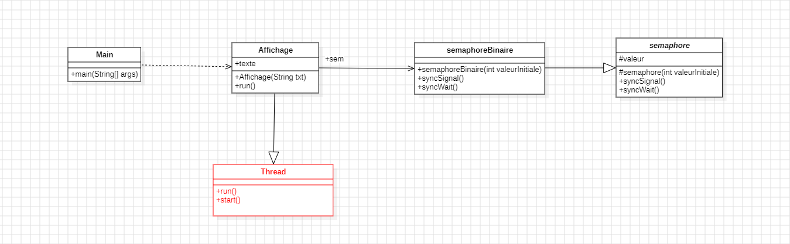
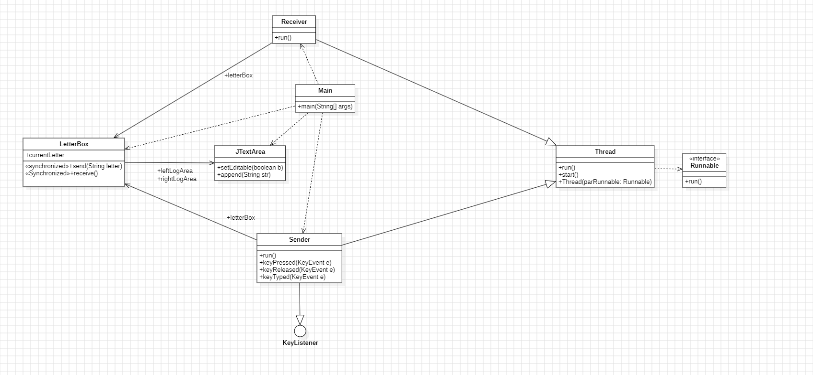
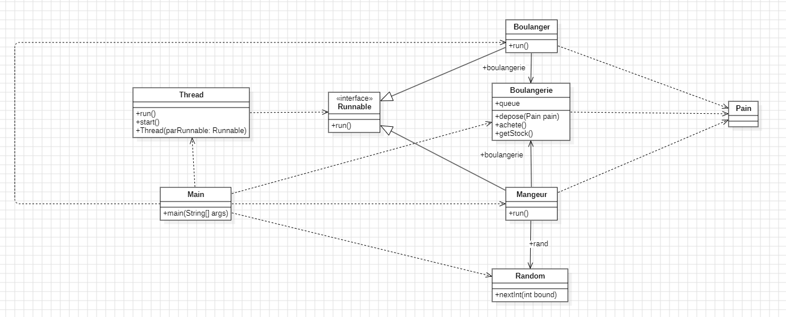
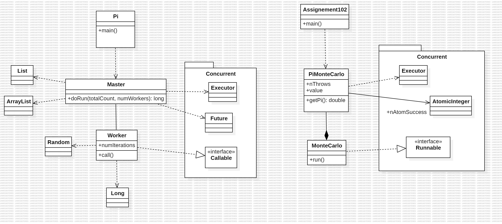
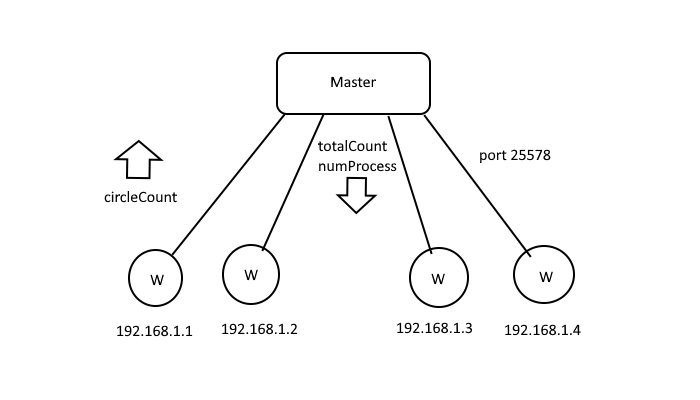
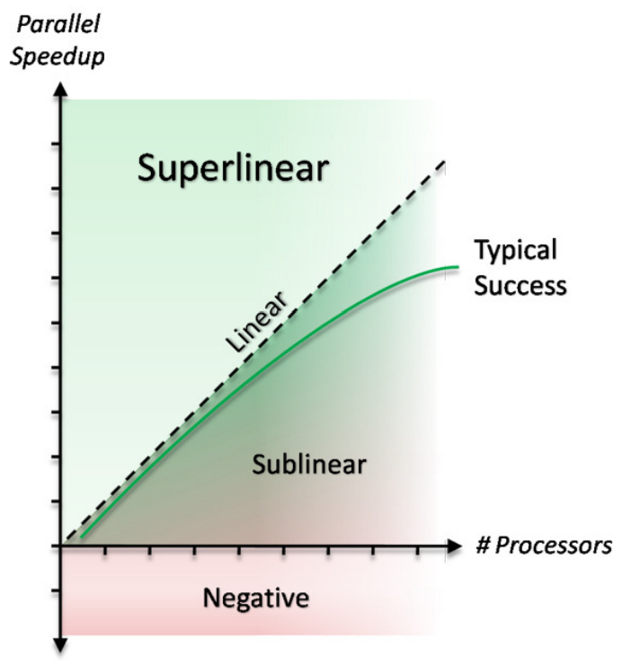

# Rapport TP/TD Programmation parallèle / avancée

## Introduction


Le multi-threading est une technique informatique permettant à un programme d’exécuter plusieurs tâches simultanément en divisant son exécution en threads, ou fils d'exécution. Ces threads partagent les ressources du processus principal et peuvent s’exécuter en parallèle ou en quasi-simultané, selon les capacités du processeur. Cette approche optimise les performances, améliore la réactivité des applications, et permet une meilleure utilisation des ressources système. Cependant, elle introduit une complexité accrue, nécessitant une gestion rigoureuse pour éviter les problèmes de concurrence ou de synchronisation.

## Sommaire
<a href="#partie-1--introduction-au-calcule-parrallèle">Partie 1 : Introduction au calcule parrallèle.</a>
<br>
<a href="#partie-2--méthode-de-monte-carlo">Partie 2 : Méthode de Monte-Carlo</a>

# Partie 1 : Introduction au calcule parrallèle.

## TP 1 : Simulation du mouvement d'un ou plusieurs mobiles

En Java, un thread est une unité d'exécution permettant d'effectuer plusieurs tâches simultanément dans un programme. L'interface `Runnable` offre une manière d'implémenter des threads sans hériter de la classe `Thread`. En implémentant `Runnable`, on définit la méthode `run()` qui contient le code que le thread doit exécuter. Ensuite, un objet `Thread` utilise cette instance de `Runnable` pour lancer l'exécution concurrente avec la méthode `start()`. L'utilisation de `Runnable` est souvent privilégiée, car elle permet de séparer la logique métier de l'implémentation du thread, offrant ainsi plus de flexibilité.

### Exercice 1

Dans l'exercice 1, il est demandé de créer une simple fenêtre avec un petit carré (UnMobile) se déplaçant de gauche à droite.  
Le code du mobile étant déjà implémenté, la seule chose à faire est de créer le code de la fenêtre avec les lignes suivantes :

```java
class UneFenetre extends JFrame // Création de la classe
{
    UnMobile sonMobile; // déclaration du mobile
    private final int LARG=400, HAUT=250; // déclaration des constantes largeur + hauteur
    
    public UneFenetre()
    {
        sonMobile = new UnMobile(LARG, HAUT); // Ici on instancie la classe un Mobile 
        add(sonMobile); // Cette ligne ajoute la classe sonMobile au JFrame

        Thread threadMobile = new Thread(sonMobile); // Cette ligne crée le thread sonMobile ; pour l'instant il est juste créé et reste éteint
        threadMobile.start(); // Cette fonction démarre le thread et exécute la fonction run de notre classe sonMobile.

        setSize(LARG, HAUT); // Définition des dimensions de la fenêtre
        setDefaultCloseOperation(JFrame.EXIT_ON_CLOSE); // Définition de l'opération par défaut lors de la fermeture de la fenêtre Java
        setVisible(true); // Affiche la fenêtre
    }
}
```

Ici, il s'agit simplement de créer un thread et de le lancer avec `.start()`.

Par la suite, il faudra faire en sorte que le mobile reparte en sens inverse lorsqu'il atteint une extrémité de la fenêtre. Pour cela, plusieurs choix étaient possibles ; j'ai personnellement choisi celui-ci :

```java
public void run()
{
    for (sonDebDessin=0; sonDebDessin < saLargeur - sonPas; sonDebDessin+= sonPas)
    {
        repaint();
        try{Thread.sleep(sonTemps);}
        catch (InterruptedException telleExcp)
            {telleExcp.printStackTrace();}
    }
    for (sonDebDessin=saLargeur - sonPas; sonDebDessin >= 0 + sonPas; sonDebDessin-= sonPas)
    {
        repaint();                                      // Duplication de la boucle for avec un compteur partant de la valeur de fin de l'autre
        try{Thread.sleep(sonTemps);}                    // Et arrivant jusqu'à 0 (+ sonPas pour assurer un petit décalage esthétique)
        catch (InterruptedException telleExcp)          // sonMobile partira de l'extrême droite pour finir à l'extrême gauche
            {telleExcp.printStackTrace();}
    }
}
```

### Exercice 2

Dans l'exercice 2, on ajoute un simple bouton start/stop pour gérer l'exécution du threadMobile (avec les méthodes `.suspend()` & `.resume()` de la classe Thread).

Pour cela, on ajoute le code suivant à la classe `UneFenetre` :

```java
class UneFenetre extends JFrame // Création de la classe
{
    UnMobile sonMobile; // déclaration du mobile
    private final int LARG=400, HAUT=250; // déclaration des constantes largeur + hauteur
    boolean isRunning = true; // Variable de gestion de l'état du thread
    
    public UneFenetre()
    {
        sonMobile = new UnMobile(LARG, HAUT); // Ici on instancie la classe un Mobile 
        add(sonMobile); // Cette ligne ajoute la classe sonMobile au JFrame

        JButton controlButton = new JButton("Start/Stop"); // Ici on crée une classe JButton avec comme titre "Start/Stop"
        add(controlButton, "South");  // Ajout du bouton au JFrame en position "sud" (autrement dit en bas de la fenêtre)

        Thread threadMobile = new Thread(sonMobile); // Cette ligne crée le thread sonMobile, pour le moment il est juste créé et reste éteint
        threadMobile.start(); // Cette fonction démarre le thread et exécute la fonction run de notre classe sonMobile.

        /*
            Le bloc d'instructions ci-dessous ajoute un "event handler" pour déclencher la fonction donnée en paramètre en fonction d'un évènement particulier (ici, appuyer sur le bouton Start/Stop).

            *Notez que la variable isRunning permet le bon suivi de l'exécution du thread*
        */
        controlButton.addActionListener(new ActionListener() {
            public void actionPerformed(ActionEvent e) {
                if (isRunning) {
                    threadMobile.suspend(); // Grâce à cette fonction, le thread du mobile s'arrête et attend la fonction .resume()
                } else {
                    threadMobile.resume(); // Ici, le thread mis en pause avec .suspend() reprend là où il s'était arrêté
                }
                isRunning = !isRunning;
            }
        });

        setSize(LARG, HAUT);
        setDefaultCloseOperation(JFrame.EXIT_ON_CLOSE);
        setVisible(true);
    }
}
```

### Exercice 3

L'exercice 3 nous demande de modifier le code en utilisant la classe GridLayout pour créer une grille de 2 par 2 avec un bouton et un mobile pour chaque cellule. J'ai décidé de ne pas reprendre exactement le code de l'exercice pour mieux intégrer cet exercice dans mon programme. Voici le résultat :

```java
class UneFenetre extends JFrame 
{
    UnMobile sonMobile1, sonMobile2;
    JButton controlButton1, controlButton2;
    Thread threadMobile1, threadMobile2;
    private final int LARG=400, HAUT=250;
    boolean isRunning1 = true, isRunning2 = true;
    
    public UneFenetre()
    {
        // Paramétrage de la grille de 2 par 2
        Container leConteneur = getContentPane();
        leConteneur.setLayout(new GridLayout(2, 2));

        // Création du premier mobile / bouton / thread
        sonMobile1 = new UnMobile(LARG, HAUT);
        controlButton1 = new JButton("Start/Stop");

        leConteneur.add(controlButton1, "South");
        leConteneur.add(sonMobile1);

        threadMobile1 = new Thread(sonMobile1);
        threadMobile1.start();

        controlButton1.addActionListener(new ActionListener() {
            public void actionPerformed(ActionEvent e) {
                if (isRunning1) {
                    threadMobile1.suspend();
                } else {
                    threadMobile1.resume();
                }
                isRunning1 = !isRunning1;
            }
        });

        // Création du deuxième mobile / bouton / thread
        sonMobile2 = new UnMobile(LARG, HAUT);
        controlButton2 = new JButton("Start/Stop");

        leConteneur.add(controlButton2, "South");
        leConteneur.add(sonMobile2);

        threadMobile2 = new Thread(sonMobile2);
        threadMobile2.start();

        controlButton2.addActionListener(new ActionListener() {
            public void actionPerformed(ActionEvent e) {
                if (isRunning2) {
                    threadMobile2.suspend();
                } else {
                    threadMobile2.resume();
                }
                isRunning2 = !isRunning2;
            }
        });

        // Paramétrage de la fenêtre
        setSize(LARG*2, HAUT*2);
        setDefaultCloseOperation(JFrame.EXIT_ON_CLOSE);
        setVisible(true);
    }
}
```

Ici, j'ai simplement dupliqué le code servant à créer un bouton et un thread mobile pour en gérer un deuxième. Le fonctionnement est exactement le même, sauf que cette fois, la classe Container aura un layout de type GridLayout, formant une grille 2x2. La gestion des threads reste inchangée.

Voici le schéma UML final du TP1 :


## TP 2 : Affichage - Exclusion et Semaphore

Dans le TP2, on introduit le concept de `Semaphore`.  
Un `Semaphore` est un moyen de contrôler l'accès à une ressource partagée entre différents threads pour éviter les conflits et optimiser l'utilisation d'un programme.

Tout le fonctionnement du sémaphore repose sur sa valeur entière. Voici comment elle est manipulée dans la classe :

- Une fonction `syncWait()` vérifie la valeur du sémaphore ; si elle est égale à 0, la fonction bloque l'exécution du thread avec la méthode `wait()`, sinon elle décrémente cette valeur de un.
- Une fonction `syncSignal()` ré-incrémente la valeur interne du sémaphore de un et débloque tous les threads précédemment bloqués sur `wait()` grâce à la fonction `notifyAll()`.

La problématique du TP2 est la suivante :

Comment s'assurer que la console affiche bien un message au format `AABBB` ?

Comme la gestion de l'affichage est multi-thread, les threads ne gèrent pas la priorité d'affichage, ce qui entraîne un affichage désordonné dans la console, par exemple `ABABB`. Les threads peuvent s'exécuter en même temps, produisant un mauvais résultat. Pour éviter cela, on utilise la classe `Semaphore` pour protéger la boucle `for` qui gère l'affichage en tant que ressource critique. Voici le fonctionnement :

- 4 threads sont lancés en même temps : "AAA", "BB", "CCCC", "DDD".
- Le premier thread qui atteint la fonction `syncWait()` décrémente la valeur du `Semaphore` à 0 et, ce faisant, verrouille tous les autres threads qui atteindront la fonction `wait()`, car le `Semaphore` est à 0.
- Lorsque le thread non verrouillé termine son exécution, il atteint la fonction `syncSignal()`, qui ré-incrémente la valeur du sémaphore et déverrouille tous les autres threads.
- Le premier thread qui atteindra à nouveau `syncWait()` reproduira le même comportement, et la boucle continuera jusqu'à la fin du programme.

Grâce à ce mécanisme, les threads s’empêchent mutuellement d’exécuter la même partie de code "critique" en même temps.

Voici le schéma UML final du TP2 :



## TP 3 : Boîte aux lettres et boulangerie  

Le TP 3 introduit le concept de **Blocking Queue** avec, dans un premier temps, l'implémentation simple d'une boîte aux lettres.  
Un producteur dépose une lettre, et un consommateur en retire une.  
Cependant, il y a plusieurs conditions :  

- Le producteur ne dépose sa "lettre" dans la boîte aux lettres (BAL) que si elle est vide.  
- Le consommateur ne retire une "lettre" de la BAL que si elle en contient une.  

On peut déjà voir, à travers cet énoncé, que le producteur et le consommateur sont deux threads distincts, et que la boîte aux lettres constitue ici une section critique.  

La boîte aux lettres fera office de file d'attente bloquante pour les threads, afin de respecter les différentes conditions.  

```java
public synchronized void send(String letter) {
        try {
            while(currentLetter != null) {
                wait();   // Ici, si la boîte aux lettres contient déjà une lettre, le producteur sera obligé de s'arrêter à son prochain envoi.
            }

            System.out.println("LetterBox send: " + letter);
            currentLetter = letter;
            notify();     // Ici, on débloque le thread du consommateur s'il est bloqué à l'instruction wait().
        }
        catch(InterruptedException e) {
            e.printStackTrace();
        }
    }

    public synchronized String receive() {
        try {
            while (currentLetter == null) {
                wait(); // Ici, si la boîte aux lettres est vide, le consommateur sera obligé de s'arrêter à son prochain essai de retrait.
            }
            String letter = currentLetter; // copie

            currentLetter = null;
            notify();       // Ici, on débloque le thread du producteur s'il est bloqué à l'instruction wait().

            System.out.println("LetterBox receive: " + letter);
            return letter;
        }
        catch(InterruptedException e) {
            e.printStackTrace();
            return "failed";
        }
    }
```  

Ici, la fonction `send()` bloque le thread du producteur si la boîte aux lettres contient déjà une lettre ; il y a une mise en attente dans la file. Le thread sera débloqué uniquement si la fonction `receive()` atteint le `notify()`.  
Tandis que la fonction `receive()` bloque le thread du consommateur si la boîte aux lettres est vide ; il ne peut pas récupérer de lettre lorsqu'il n'y en a pas.  
Le thread sera débloqué uniquement si la fonction `send()` atteint le `notify()`.  

Par la suite, on implémentera la possibilité de mettre fin aux threads avec la lettre "Q", et on ajoutera une interface graphique simple, ce qui nous permettra, en plus, d'écouter le clavier de l'utilisateur pour envoyer des lettres dans la file grâce à l'interface `KeyListener`.  

Voici le schéma UML final de la première partie de ce TP :  

  

Cette première partie du TP3 nous apprend à implémenter un système de file d'attente (ou **Blocking Queue**), mais la deuxième partie nous apprendra à implémenter un fonctionnement plus avancé de ce système en utilisant, cette fois, des classes propres à Java.  

Dans la 2ᵉ partie du TP, la majorité de l'exercice tourne autour de la classe `ArrayBlockingQueue`.  
On retrouve le même fonctionnement que notre boîte aux lettres, mais cette fois-ci, il n'est pas question d'un seul élément (une lettre), mais bien d'une vraie file d'attente avec plusieurs éléments.  

Ici, les `consommateurs` seront remplacés par la classe `Mangeur`, les `producteurs` par la classe `Boulanger`, la boîte aux lettres par la classe `Boulangerie`, et les lettres par une simple classe `Pain`.  

Voici un extrait de la classe `Boulangerie`, qui est le cœur de la coordination des threads :  

```java
private BlockingQueue<Pain> queue =  new ArrayBlockingQueue<Pain>(20); // Voici la classe principalement visée par ce paradigme.

public boolean depose(Pain pain) throws InterruptedException {
    return queue.offer(pain, 200, TimeUnit.MILLISECONDS);
}

public Pain achete() throws InterruptedException {
    return queue.poll(200, TimeUnit.MILLISECONDS);
}

public int getStock() {
    return queue.size();
}
```  

Cette classe est une version modifiée de la classe bien connue `ArrayList`, qui permet de rajouter, supprimer ou modifier des éléments dans un tableau.  

Les particularités de cette classe sont les suivantes :  

- Cette classe utilise une structure de données en file, dite FIFO (First In, First Out).  
- Les fonctions d'ajout et de récupération (`offer()` & `poll()`) sont dites "bloquantes". Cela signifie que lorsque le nombre d'éléments dans la file dépasse le nombre maximal paramétré lors de l'instanciation de la classe, la fonction bloque le thread qui l'exécute jusqu'à ce qu'un autre thread libère de la place. Et inversement, lorsque la file est vide et qu'on essaye de récupérer un élément, la fonction bloque le thread jusqu'à ce que la file soit de nouveau remplie.  

C'est le principe de la classe `ArrayBlockingQueue`.  

Voici le schéma final de la seconde partie de ce TP3 :  

  

## Conclusion

Au travers de ces trois TP, nous avons exploré différents concepts fondamentaux de la programmation parallèle, notamment le multi-threading, la synchronisation, et la gestion des ressources partagées.

Dans le premier TP, nous avons introduit la notion de threads et appris à les gérer pour créer des applications interactives et réactives.
Le deuxième TP nous a familiarisés avec les mécanismes de synchronisation, comme les sémaphores, pour garantir l'exclusion mutuelle et éviter les conflits entre threads.
Enfin, le troisième TP nous a permis de mettre en œuvre des systèmes de communication entre threads via des files bloquantes, tout en découvrant des abstractions avancées de Java comme ArrayBlockingQueue.


----
# **Partie 2 : Méthode de Monte-Carlo**

<i>Cette partie 2 a été rédigée en partie grâce à l'aide de l'intelligence artificielle ChatGPT</i>

## **Introduction**

La méthode de Monte Carlo (MC) permet d’estimer π en utilisant des tirages aléatoires. Cette approche est facilement parallélisable et peut être implémentée sur des architectures à mémoire partagée ou distribuée.

### **Principe de la méthode Monte Carlo**

On considère un quart de disque de rayon $r = 1$ inscrit dans un carré de côté 1.
- Aire du quart de disque : $A_{	ext{quartD}} = \frac{\pi}{4}$
- Aire du carré : $A_c = 1$
- Probabilité qu’un point aléatoire $(x_p, y_p)$ appartienne au quart de disque :  
  $$P = \frac{A_{	ext{quartD}}}{A_c} = \frac{\pi}{4}$$

L’approximation de π se fait via la fréquence des points appartenant au quart de disque :  
  $$\pi \approx 4 \times \frac{n_{	ext{cible}}}{n_{	ext{tot}}}$$

## **I. Algorithme séquentiel**

```c
n_cible = 0;
for (p = 0; n_tot > 0; n_tot--) {
    x_p = rand();  // Générer un nombre aléatoire entre ]0,1[
    y_p = rand();
    if ((x_p * x_p + y_p * y_p) < 1) {
        n_cible++;
    }
}
pi = 4 * n_cible / n_tot;
```

### Décomposition des étapes : 
- étape 1 : Tirer des points aléatoires x/y entre 0 et 1
- étape 2 : Compter les points qui sont dans le quart de disque
- étape 3 : Calculer la valeur de pi a partir de se compteur

## **II. Parallélisation**

### **A. Itération parallèle**

L'algorithme est parallélisé en divisant les tirages entre plusieurs threads.

#### **Tâches identifiées**

1. **Génération des points** $(x_p, y_p)$ (indépendants, parallélisables).
2. **Vérification de la condition $x_p^2 + y_p^2 < 1$** et incrémentation de `n_cible` (nécessite une synchronisation).
3. **Calcul final de π** après la collecte des résultats.

#### **Problèmes et solutions**
- **Conflits d'accès sur `n_cible`** → Utilisation d'une variable atomique ou d'un verrou. (mutex / semaphore)

#### **Algorithme parallèle avec boucle `parallel for`**

```c
function TirerPoint() {
    x_p = rand();
    y_p = rand();
    return ((x_p * x_p + y_p * y_p) < 1);
}

n_cible = 0;
parallel for (p = 0; n_tot > 0; n_tot--) {
    if (TirerPoint()) {
        n_cible++;
    }
}
pi = 4 * n_cible / n_tot;
```

### **B. Modèle Master/Worker**

- **Master** : répartit le travail.
- **Workers** : réalisent une partie des tirages et renvoient leur résultat.
- **Synchronisation minimale** car chaque Worker utilise un compteur local.

#### **Algorithme Master/Worker**

```c
function MCWorker(n_charge) {
    n_cible_partiel = 0;
    for (p = 0; n_charge > 0; n_charge--) {
        if (TirerPoint()) {
            n_cible_partiel++;
        }
    }
    return n_cible_partiel;
}

n_charge = n_tot / n_workers;
ncibles = [NULL * n_workers];
parallel for (worker = 0; worker < n_workers; worker++) {
    ncibles[worker] = MCWorker(n_charge);
}
n_cible = sum(ncibles);
pi = 4 * n_cible / n_tot;
```

### **Avantages du modèle Master/Worker**

- **Réduction des conflits** : chaque Worker travaille sur des données locales.
- **Meilleure scalabilité** : charge répartie entre plusieurs threads/machines.
- **Adaptabilité aux environnements distribués** : chaque Worker peut s’exécuter sur une machine distincte.

## **III. Mise en œuvre sur Machine**

### **A. Définitions et contexte**

### **1. `Callable<T>` : Une tâche qui retourne un résultat**
#### **Définition :**
Un **`Callable<T>`** est une interface qui représente une **tâche parallèle capable de renvoyer une valeur**. Contrairement à **`Runnable`**, qui ne retourne rien (`void`), un **`Callable<T>`** retourne un objet de type `T` et peut lever des exceptions (`Exception`).  

#### **Syntaxe :**
```java
import java.util.concurrent.Callable;

class MaTache implements Callable<Integer> {
    @Override
    public Integer call() throws Exception {
        int resultat = 42;  // Simulation d’un calcul
        return resultat; 
    }
}
```

#### **Comparaison avec `Runnable`**
| Caractéristique | `Callable<T>` | `Runnable` |
|----------------|--------------|------------|
| **Retourne un résultat** | ✅ Oui (`T`) | ❌ Non (`void`) |
| **Peut lever une exception** | ✅ Oui (`Exception`) | ❌ Non (uniquement `RuntimeException`) |
| **Utilisé avec** | `ExecutorService.submit()` | `ExecutorService.execute()` |

---

### **2. `Future<T>` : Un conteneur pour un résultat asynchrone**
#### **Définition :**
Un **`Future<T>`** représente un **résultat futur** d’un **`Callable<T>`**. Il permet :
- De **vérifier si la tâche est terminée** (`isDone()`).
- De **récupérer le résultat** (`get()`), en **bloquant si nécessaire**.
- D’**annuler** la tâche (`cancel()`).

#### **Exemple d'utilisation d'un `Future`**
```java
import java.util.concurrent.*;

public class ExempleFuture {
    public static void main(String[] args) throws Exception {
        ExecutorService executor = Executors.newFixedThreadPool(2);

        // Soumission d'une tâche avec Callable
        Future<Integer> futureResult = executor.submit(() -> {
            Thread.sleep(2000); // Simule un calcul long
            return 42;
        });

        // Vérifie si la tâche est terminée
        while (!futureResult.isDone()) {
            System.out.println("Tâche en cours...");
            Thread.sleep(500);
        }

        // Récupère le résultat (bloque si pas terminé)
        int resultat = futureResult.get();
        System.out.println("Résultat obtenu : " + resultat);

        executor.shutdown();
    }
}
```

### **Résumé**
| **Concept** | **Définition** | **Utilité** |
|------------|---------------|-------------|
| `Callable<T>` | Interface représentant une **tâche parallèle** qui retourne un **résultat** | Permet d’effectuer un calcul et récupérer un résultat |
| `Future<T>` | Objet contenant le **résultat futur** d’un `Callable<T>` | Permet de récupérer un résultat **une fois la tâche terminée** |

---

### **3. Variables Atomiques (`AtomicInteger`, `AtomicLong`) : Gestion Sécurisée des Données Partagées**  

### **Problème des Variables Partagées en Multi-Threading**
Lorsque plusieurs threads accèdent et modifient **simultanément** une même variable, des **problèmes de concurrence** peuvent survenir, comme des résultats incohérents.  

#### **Exemple sans variable atomique (problème de synchronisation)**  
```java
class Compteur {
    private int valeur = 0;

    public void incrementer() {
        valeur++;  // Problème : l'incrémentation n'est PAS atomique !
    }

    public int getValeur() {
        return valeur;
    }
}

public class TestCompteur {
    public static void main(String[] args) throws InterruptedException {
        Compteur compteur = new Compteur();

        // Deux threads qui incrémentent en même temps
        Thread t1 = new Thread(() -> {
            for (int i = 0; i < 1000; i++) compteur.incrementer();
        });

        Thread t2 = new Thread(() -> {
            for (int i = 0; i < 1000; i++) compteur.incrementer();
        });

        t1.start();
        t2.start();
        t1.join();
        t2.join();

        System.out.println("Valeur attendue : 2000");
        System.out.println("Valeur réelle : " + compteur.getValeur()); // Erreur possible !
    }
}
```
**Résultat possible (erreur due à la concurrence) :**  
```
Valeur attendue : 2000  
Valeur réelle : 1985  (ou autre valeur incorrecte)
```
Le problème vient du fait que l’opération `valeur++` n'est **pas atomique**, c’est-à-dire qu’elle se décompose en plusieurs instructions machine :
1. Lire la valeur actuelle de `valeur`
2. Ajouter 1
3. Écrire la nouvelle valeur  

Si deux threads exécutent cette opération **en même temps**, l’un peut écraser le résultat de l’autre.

---

### **Solution : `AtomicInteger` pour une Incrémentation Sécurisée**
La classe **`AtomicInteger`** fournit des **opérations atomiques** comme `incrementAndGet()`, qui garantissent que l'incrémentation est **indivisible et sans interférence**.

#### **Exemple avec `AtomicInteger` (résolution du problème)**
```java
import java.util.concurrent.atomic.AtomicInteger;

class CompteurAtomique {
    private AtomicInteger valeur = new AtomicInteger(0);

    public void incrementer() {
        valeur.incrementAndGet(); // Incrémentation atomique
    }

    public int getValeur() {
        return valeur.get();
    }
}

public class TestCompteurAtomique {
    public static void main(String[] args) throws InterruptedException {
        CompteurAtomique compteur = new CompteurAtomique();

        Thread t1 = new Thread(() -> {
            for (int i = 0; i < 1000; i++) compteur.incrementer();
        });

        Thread t2 = new Thread(() -> {
            for (int i = 0; i < 1000; i++) compteur.incrementer();
        });

        t1.start();
        t2.start();
        t1.join();
        t2.join();

        System.out.println("Valeur attendue : 2000");
        System.out.println("Valeur réelle : " + compteur.getValeur()); // Toujours correcte
    }
}
```
**Résultat toujours correct :**
```
Valeur attendue : 2000  
Valeur réelle : 2000
```

---

### **3. Comparaison entre Synchronisation et Variables Atomiques**
| Approche | Description | Avantages | Inconvénients |
|----------|------------|-----------|--------------|
| **`synchronized` (verrou)** | Protège un bloc de code contre les accès concurrents | Fiable et applicable à toute structure | Peut ralentir l’exécution à cause des verrous |
| **`AtomicInteger`** | Opérations atomiques sur un entier | Très performant car sans verrou | Limité aux types de données atomiques (`int`, `long`, `boolean`) |


## **B. Analyse de `Assignment102.java`**

### **1. Structure et API utilisée**
#### **a) Parallélisation avec `ExecutorService` et `Runnable`**
Le programme `Assignment102` utilise **`ExecutorService`** pour exécuter des tâches parallèles. Il repose sur un **pool de threads adaptatif** (`newWorkStealingPool`) et exécute chaque tirage Monte Carlo via une tâche **`Runnable`**.  

#### **Extrait du code : Création des threads avec `Runnable`**
```java
class MonteCarlo implements Runnable {
    @Override
    public void run() {
        double x = Math.random();
        double y = Math.random();
        if (x * x + y * y <= 1)
            nAtomSuccess.incrementAndGet(); // Incrémentation atomique si le point est dans le cercle
    }
}
```
- **Chaque thread génère un point `(x, y)` aléatoire**.
- **Si le point est dans le quart de disque**, `nAtomSuccess.incrementAndGet()` est appelé pour compter le succès.

---

#### **b) Gestion des tâches avec `ExecutorService`**
```java
ExecutorService executor = Executors.newWorkStealingPool(nProcessors);
for (int i = 1; i <= nThrows; i++) {
    Runnable worker = new MonteCarlo();
    executor.execute(worker);
}
executor.shutdown();
while (!executor.isTerminated()) {} // Attente de la fin des tâches
```
- **Un pool de threads est créé** avec `newWorkStealingPool(nProcessors)`, qui exploite le **nombre optimal de threads**.
- **Chaque tirage Monte Carlo est soumis comme une tâche `Runnable`**.
- **Le programme attend la fin de l’exécution** avec `executor.shutdown()` et `while (!executor.isTerminated()) {}`.

---

#### **c) Calcul et stockage du résultat**
```java
value = 4.0 * nAtomSuccess.get() / nThrows; // Approximation de Pi
System.out.println("Approx value:" + value);
System.out.println("Difference to exact value of pi: " + (value - Math.PI));
```
- `nAtomSuccess.get()` retourne **le nombre total de points dans le quart de disque**.
- **L'approximation de π est obtenue par la formule** :  
  \[
  \pi \approx 4 \times \frac{\text{nombre de succès}}{\text{nombre total de lancers}}
  \]
  
---

### **2. Problèmes et limites**
#### **🚩 Problème de synchronisation avec `AtomicInteger`**
L’utilisation de `AtomicInteger` pour **chaque tirage individuel** introduit un **goulot d’étranglement**. En effet, `incrementAndGet()` force **une synchronisation entre threads**, ce qui réduit les performances.

**✅ Solution possible :**  
- **Utiliser un compteur local dans chaque thread**, puis agréger à la fin, **réduisant ainsi la contention sur `AtomicInteger`**.

---

### **3. Comparaison avec le pseudo-code**
| **Pseudo-code Monte Carlo** | **`Assignment102.java`** |
|--------------------------|-------------------|
| Boucle `for` sur `N` itérations | Boucle `for` soumettant `N` tâches `Runnable` |
| Vérification `(x² + y² ≤ 1)` | `if (x * x + y * y <= 1) nAtomSuccess.incrementAndGet();` |
| Calcul final de π | `4.0 * nAtomSuccess.get() / nThrows;` |

---

## **C. Analyse de `Pi.java`**

### **1. Structure et API utilisée**
Contrairement à `Assignment102`, le programme `Pi.java` utilise **une approche Master/Worker avec `Callable<T>` et `Future<T>`**, qui améliore la gestion du parallélisme.

---

**a) Création des tâches avec `Callable<Long>`** <br>
Au lieu de **soumettre une tâche par tirage individuel**, `Pi.java` regroupe **plusieurs tirages dans une seule tâche** (meilleur équilibre entre parallélisme et performance).

#### **Extrait : Classe `Worker` qui exécute les calculs**
```java
class Worker implements Callable<Long> {   
    private int numIterations;
    public Worker(int num) { this.numIterations = num; }

    @Override
    public Long call() {
        long circleCount = 0;
        Random prng = new Random();
        for (int j = 0; j < numIterations; j++) {
            double x = prng.nextDouble();
            double y = prng.nextDouble();
            if ((x * x + y * y) < 1)  ++circleCount;
        }
        return circleCount; // Retourne le nombre de succès
    }
}
```
- **Chaque `Worker` gère `numIterations`** (au lieu d’un seul tirage comme dans `Assignment102`).
- **Utilisation de `Callable<Long>` au lieu de `Runnable`** :  
  - `Runnable` ne retourne **pas de valeur**  
  - `Callable<Long>` retourne **le nombre de succès (points dans le cercle)**.

---

**b) Gestion des threads avec `Future<Long>`** <br>
La classe `Master` gère les **threads et l’agrégation des résultats**.

#### **Extrait : Lancement et récupération des résultats**
```java
ExecutorService exec = Executors.newFixedThreadPool(numWorkers);
List<Future<Long>> results = exec.invokeAll(tasks); // Exécution parallèle

long total = 0;
for (Future<Long> f : results) {
    total += f.get(); // Récupère chaque résultat
}

double pi = 4.0 * total / totalCount / numWorkers;
```
- **Création d'un pool fixe de `numWorkers` threads** (`FixedThreadPool`).
- **Les tâches sont soumises en parallèle et `invokeAll()` attend qu'elles terminent**.
- **Agrégation finale : récupération des résultats avec `Future<Long>.get()`**.

---

**c) Calcul final et affichage des résultats** <br>
```java
System.out.println("\nPi : " + pi );
System.out.println("Error: " + (Math.abs((pi - Math.PI)) / Math.PI) +"\n");
```
L'erreur est calculée et affichée, comme dans `Assignment102`.

---

### **2. Problèmes et limites**
#### **✅ Meilleure gestion des threads**
- `Pi.java` **évite le problème de contention de `AtomicInteger`** en utilisant des **compteurs locaux** dans chaque `Worker`, puis **une agrégation finale avec `Future<Long>`**.
- Moins de **synchronisation coûteuse**, car `Future.get()` bloque **uniquement lors de l'agrégation**, et non à chaque tirage.

---

## **D. Comparaison entre `Assignment102.java` et `Pi.java`**
| Critère | `Assignment102.java` | `Pi.java` |
|---------|-----------------|----------|
| **Modèle** | Parallélisation simple avec `Runnable` | Modèle Master/Worker avec `Callable<T>` |
| **Type de pool** | `newWorkStealingPool(nProcessors)` | `FixedThreadPool(numWorkers)` |
| **Gestion des résultats** | `AtomicInteger.incrementAndGet()` pour chaque tirage | Agrégation finale via `Future<Long>.get()` |
| **Problème majeur** | Contention sur `AtomicInteger` | Synchronisation uniquement à la fin |
| **Performance** | Plus de synchronisation, moins efficace | Plus efficace avec `Callable<T>` |

---

### **Conclusion**
- **`Assignment102.java` est plus simple mais inefficace**, à cause du goulot d’étranglement sur `AtomicInteger`.
- **`Pi.java` optimise la parallélisation avec des `Callable<T>` et `Future<T>`**, réduisant les synchronisations inutiles.
- **Meilleure approche : `Pi.java`**, surtout sur des machines multicœurs.


## **E. Schéma UML de pi.java et assignment102.java**
  

## **F. Approche Master/Worker**

### **1. Introduction**

L'approche Master/Worker repose sur la délégation des tâches à plusieurs travailleurs (Workers) par un maître (Master). Le Master se charge de distribuer le travail, de collecter les résultats et de les agréger pour obtenir le résultat final. Cette découpe se fait a travers plusieurs codes/executions différentes, ce qui fait que la mise en place d'une communication réseaux est facilement implémentable.

### **2. Architecture**

* **Master :**
    * Lance une connexion vers chaques Workers via des `sockets`
    * Envoi par messages, les paramètres d'éxecutions : (points a générer `totalCount`, processus a utiliser `numProcess`)
    * Reçois pour chaques `sockets` le nombre de points tombant dans le quart de disque de chaque Worker
    * Calcule Pi à partir des résultats obtenu par chaques Workers

* **Workers :**
    * Créer un `socket` qui attend une connexion master et écoute ses messages 
    * Reçois des paramètres d'éxecutions : ici le nombre de points à tirer
    * Fait ses tirages aléatoires en fonction du nombres de points à tirer
    * Envoi le résultat `circleCount` au Master via le `socket`

  

### **3. Les sockets**

Java fournit deux principaux types de sockets :

1. **Sockets TCP (Transmission Control Protocol)**
   - Basés sur une connexion fiable.
   - Garantissent l'ordre des messages et l'intégrité des données.
   - Exemples : HTTP, FTP, SMTP.

2. **Sockets UDP (User Datagram Protocol)**
   - Connexion non fiable, sans garantie d’ordre ni d'intégrité.
   - Plus rapide et léger que TCP.
   - Exemples : VoIP, Streaming vidéo.

---

**Dans cet excercice nous allons nous concentrer d'avantage sur les sockets TCP car nous voulons une connexion fiable mais pas forcément rapide**


#### **🔹 Serveur TCP (Java)**
Le serveur utilise `ServerSocket` pour écouter les connexions entrantes.

```java
import java.io.*;
import java.net.*;

public class Serveur {
    public static void main(String[] args) {
        try (ServerSocket serverSocket = new ServerSocket(1234)) {
            System.out.println("Serveur en attente de connexion...");

            Socket socket = serverSocket.accept();
            System.out.println("Client connecté");

            BufferedReader input = new BufferedReader(new InputStreamReader(socket.getInputStream()));
            PrintWriter output = new PrintWriter(socket.getOutputStream(), true);

            String message = input.readLine();
            System.out.println("Message reçu : " + message);
            output.println("Message bien reçu");

            socket.close();
        } catch (IOException e) {
            e.printStackTrace();
        }
    }
}
```

#### **🔹 Client TCP (Java)**
Le client utilise `Socket` pour se connecter au serveur.

```java
import java.io.*;
import java.net.*;

public class Client {
    public static void main(String[] args) {
        try (Socket socket = new Socket("localhost", 1234)) {
            BufferedReader input = new BufferedReader(new InputStreamReader(socket.getInputStream()));
            PrintWriter output = new PrintWriter(socket.getOutputStream(), true);

            output.println("Hello, Serveur !");
            String response = input.readLine();
            System.out.println("Réponse du serveur : " + response);

        } catch (IOException e) {
            e.printStackTrace();
        }
    }
}
```

---

### **4. Analyse code Master**

Le code `MasterSocket.java` utilise donc le système de socket pour organiser la parrallélisation du calcule. 

1. Initialisation des varaibles
```java
long totalCount = 1000000000; // total number of throws on a Worker
int total = 0; // total number of throws inside quarter of disk
double pi; 
```

2. Lecture des entrées au clavier, pour spécifier le nombre de worker et leurs ports / ip respectives
```java
int numWorkers = maxServer;
BufferedReader bufferRead = new BufferedReader(new InputStreamReader(System.in)); // Création d'un object de lecture d'entrées
String s; 

// Purement esthétique
System.out.println("#########################################");
System.out.println("# Computation of PI by MC method        #");
System.out.println("#########################################");

// Lecture du nombre de worker
System.out.println("\n How many workers for computing PI (< maxServer): ");
try{
    s = bufferRead.readLine();
    numWorkers = Integer.parseInt(s);
    System.out.println(numWorkers);
}
catch(IOException ioE){
    ioE.printStackTrace();
}

// Pour chaque worker, demander le port d'accès.
for (int i=0; i<numWorkers; i++){
    System.out.println("Enter worker"+ i +" port : ");
    try{
    s = bufferRead.readLine();
    System.out.println("You select " + s);
    }
    catch(IOException ioE){
    ioE.printStackTrace();
    }
}
```

3. Création des `sockets` et préparation des objets de lecture/écriture des `sockets`
```java
// Pour chaques workers 
for(int i = 0 ; i < numWorkers ; i++) {
    sockets[i] = new Socket(ip, tab_port[i]); // Création du socket
    System.out.println("SOCKET = " + sockets[i]);
    
    reader[i] = new BufferedReader( new InputStreamReader(sockets[i].getInputStream())); // Bind d'un object de lecture sur le socket
    writer[i] = new PrintWriter(new BufferedWriter(new OutputStreamWriter(sockets[i].getOutputStream())),true); // Bind d'un object d'écriture sur le socket
}
```

4. Envoi des paramètres aux worker via `sockets`
```java
String message_to_send;
message_to_send = String.valueOf(totalCount) + ":" + String.valueOf(numProcess); // Paramètres sous la forme "nombreiteration:nombreprocessus"

String message_repeat = "y"; 
long stopTime, startTime;

while (message_repeat.equals("y")){

startTime = System.currentTimeMillis();
// initialize workers
for(int i = 0 ; i < numWorkers ; i++) {
    writer[i].println(message_to_send);          // send a message to each worker
}
```

5. Attente des résultats des `Worker`
```java
// Pour chaque worker, on attend le résultat
for(int i = 0 ; i < numWorkers ; i++) {
    tab_total_workers[i] = reader[i].readLine();  
    System.out.println("Client received: " + tab_total_workers[i]);
    System.out.println("Client sent: " + tab_total_workers[i]);
}
```

6. Calculer le résultat a partir des données `worker`
```java
for(int i = 0 ; i < numWorkers ; i++) {
    total += Long.parseLong(tab_total_workers[i]);
}
pi = 4.0 * total / totalCount / numWorkers;
```

### **5. Analyse code Worker**

Le code `WorkerSocket.java` est un peu plus simple. C'est lui qui reçois les ordres du master, et fait les tirages aléatoires.

1. Attente de la connection socket du Master
```java
ServerSocket s = new ServerSocket(port); // création de l'objet socket
System.out.println("Server started on port " + port);
Socket soc = s.accept(); // Cette méthode ce bloque jusqu'à ce qu'une connection arrive.
```

2. Création des objets de lecture et écriture dans le socket
```java
BufferedReader bRead = new BufferedReader(new InputStreamReader(soc.getInputStream()));
PrintWriter pWrite = new PrintWriter(new BufferedWriter(new OutputStreamWriter(soc.getOutputStream())), true);
```

3. Attente / lecture des paramètres `totalCount` et `numProcess`
```java
String str;
while (isRunning) {
    str = bRead.readLine();          // Lecture du message du Master avec l'objet de lecture du socket
    String workerargs[] = str.split(":");
    
```

4. Tirage aléatoire et envoi des résultats au Master
```java
    if (!(str.equals("END"))){ // Si le message contient un signal d'arrêt (la chaine de charactère END), le programme s'arrête

        // Création de l'objet Master du code pi.java pour tirage aléatoire
        Master m = new Master();

        // Lancement d'une boucle de tirage aléatoire
        long circleCount = m.doRun(Integer.parseInt(workerargs[0])/Integer.parseInt(workerargs[1]), Integer.parseInt(workerargs[1]), "test.txt");

        // Envoi des résultat au master avec l'objet d'écriture du socket 
        pWrite.println(circleCount);         
    } else {
        isRunning=false; // Sortie de la boucle principal et arrêt du code
    }
}
```


## IV. Qualité et test de performance
### Objectifs
Les tests de performances, servent à plusieurs choses :
- La mesure du temps d'execution en fonction du nombre de processeurs.
- L'évaluation d'une variable qui se nomme le speedup, pendant les mesures de types scalabilitées forte et faibles.
- Analyser les résultats et les comparer avec les attentes.
- Identifier les points faibles de l'algorithme parrallélisé.

### Scalabilitée forte et faible
La scalabilité évalue comment les performances d’un système évoluent lorsqu’on augmente les ressources (processeurs, mémoire) ou la charge de travail. On distingue deux types de scalabilité :

* Scalabilité forte : Elle mesure l’efficacité du parallélisme en maintenant la taille du problème fixe tout en augmentant le nombre de ressources. L’objectif est de réduire le temps d’exécution. Une scalabilité forte idéale signifie que si l’on double les ressources, le temps d’exécution est divisé par deux.
* Scalabilité faible : Elle mesure la capacité du système à maintenir des performances constantes lorsque la charge de travail augmente proportionnellement aux ressources ajoutées. L’objectif est que le temps d’exécution reste stable.

#### **Variable speedup**
Le **Speedup** (accélération) est une mesure clé de la scalabilité forte. Il est défini comme :  

\[
S_p = \frac{T_1}{T_p}
\]

où :  
- \( S_p \) est le speedup avec \( p \) processeurs,  
- \( T_1 \) est le temps d’exécution en mode séquentiel (avec 1 processeur),  
- \( T_p \) est le temps d’exécution avec \( p \) processeurs.  

Un **speedup linéaire** signifie que l’accélération est proportionnelle au nombre de processeurs (\( S_p = p \)), ce qui est l’idéal mais rarement atteint à cause des limitations comme la synchronisation et les communications entre processeurs.

  