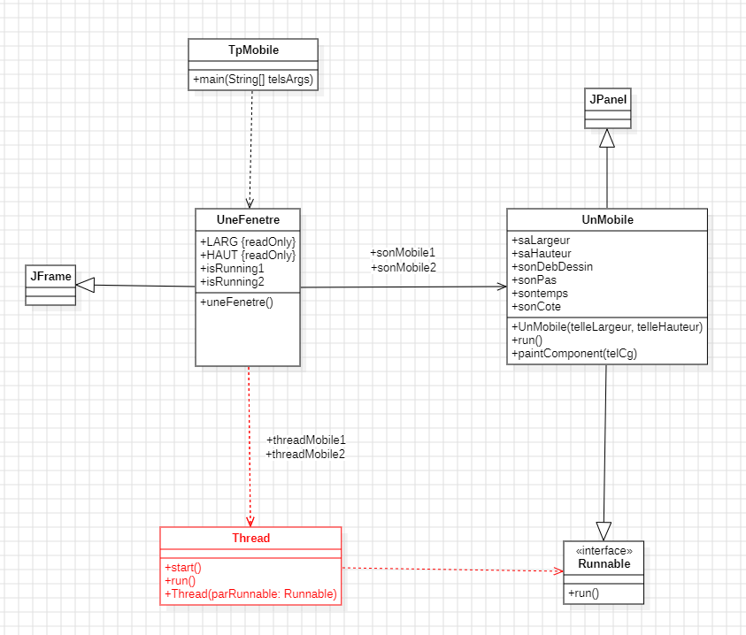

# Rapport TP/TD Programmation parallèle / avancée

## TP 1 : Simulation du mouvement d'un ou plusieurs mobiles

### Introduction 


En Java, un thread est une unité d'exécution qui permet d'effectuer plusieurs tâches simultanément dans un programme. L'interface `Runnable` est une manière d'implémenter des threads sans hériter de la classe `Thread`. En implémentant `Runnable`, on définit la méthode `run()` qui contient le code que le thread doit exécuter. Ensuite, un objet `Thread` utilise cette instance de `Runnable` pour lancer l'exécution concurrente avec la méthode `start()`. Utiliser `Runnable` est souvent préféré car cela permet de séparer la logique métier de l'implémentation du thread, offrant ainsi plus de flexibilité.


### Exercice 1

Dans l'excercice 1, il est demandé de créer une simple fenêtre avec un petit carré (UnMobile) se déplacant de gauche a droite. <br>
Le code du mobile étant déjà implémenter, la seule chose a faire est d'implémenter le code de la fenêtre avec les simples lignes : 

```java 
class UneFenetre extends JFrame // Création de la classe
{
    UnMobile sonMobile; // déclaration du mobile
    private final int LARG=400, HAUT=250; // déclaration des constantes largeur + hauteur
    
    public UneFenetre()
    {
        sonMobile = new UnMobile(LARG, HAUT); // Ici on instancie la classe un Mobile 
        add(sonMobile); // Cette ligne ajoute la classe sonMobile au JFrame

        Thread threadMobile = new Thread(sonMobile); // Cette ligne créer le thread sonMobile, pour l'instant il est juste créer et reste étein
        threadMobile.start(); // Cette fonction démarre le thread et execute la fonction run de notre classe sonMobile.

        setSize(LARG, HAUT); // Définition des dimensions de la fenêtre
        setDefaultCloseOperation(JFrame.EXIT_ON_CLOSE); // Définition de l'opération par défaut lors de la fermeture de la fenêtre java
        setVisible(true); // Affiche la fenêtre
    }
}
```


Ici rien de plus que la création d'un thread et de son lancement avec `.start()`.

Par la suite il faudra faire en sorte que le mobile reparte en sens inverse lorsqu'il atteint une extrémité de la fenêtre. Pour cela, plusieurs choix était possible, j'ai personnelement choisi celui-ci : 

```java
public void run()
{
    for (sonDebDessin=0; sonDebDessin < saLargeur - sonPas; sonDebDessin+= sonPas)
    {
        repaint();
        try{Thread.sleep(sonTemps);}
        catch (InterruptedException telleExcp)
            {telleExcp.printStackTrace();}
    }
    for (sonDebDessin=saLargeur - sonPas; sonDebDessin >= 0 + sonPas; sonDebDessin-= sonPas)
    {
        repaint();                                      // Duplication de la boucle for avec un compteur partant de la valeur de fin de l'autre
        try{Thread.sleep(sonTemps);}                    // Et arrivant jusqu'à 0 (+ sonPas pour assurer un petit décalage esthétique)
        catch (InterruptedException telleExcp)          // sonMobile partira de l'extrème droite pour finir a l'extrème gauche
            {telleExcp.printStackTrace();}
    }
}
```


### Exercice 2

Dans l'exercice 2 on ajoutera un simple bouton start/stop afin de gérer l'éxecution du threadMobile (avec les fonctions `.suspend()` & `.resume()` de la class Thread)

Pour cela on ajoutera le code suivant a la class `UneFenetre` : 

```java
class UneFenetre extends JFrame // Création de la classe
{
    UnMobile sonMobile; // déclaration du mobile
    private final int LARG=400, HAUT=250; // déclaration des constantes largeur + hauteur
    boolean isRunning = true; // Variable de gestion de l'état du thread
    
    public UneFenetre()
    {
        sonMobile = new UnMobile(LARG, HAUT); // Ici on instancie la classe un Mobile 
        add(sonMobile); // Cette ligne ajoute la classe sonMobile au JFrame

        JButton controlButton = new JButton("Start/Stop"); // Ici on créer une class JButton avec comme titre "Start/Stop"
        add(controlButton, "South");  // Ajout du bouton au JFrame en position "sud" (autrement du au plus bas de la fenêtre)

        Thread threadMobile = new Thread(sonMobile); // Cette ligne créer le thread sonMobile, pour le moment il est juste créer et reste étein
        threadMobile.start(); // Cette fonction démarre le thread et execute la fonction run de notre classe sonMobile.

        /*
            Le bloc d'instructions ci-dessous, ajoute un "event handler" c'est a dire qu'il déclenche la fonction donnée en paramètre en fonction d'un évènement particulier (ici appuyer sur le bouton Start/Stop).

            *Notez que la variable isRunning permet le bon suivi de l'execution du thread*
        */
        controlButton.addActionListener(new ActionListener() {
            public void actionPerformed(ActionEvent e) {
                if (isRunning) {
                    threadMobile.suspend(); // Grace a cette fonction, le thread du mobile s'arrête et attend la fonction .resume()
                } else {
                    threadMobile.resume(); // Ici, le thread mis en pause avec .suspend() reprend là où il s'était arrêter
                }
                isRunning = !isRunning;
            }
        });

        setSize(LARG, HAUT);
        setDefaultCloseOperation(JFrame.EXIT_ON_CLOSE);
        setVisible(true);
    }
}

```

### Exercice 3

L'exercice 3 nous demande de modifier le code en utilisant la class GridLayout afin de faire un tableau de 2 par 2 avec un bouton et un mobile pour chaques lignes.
J'ai décider de ne pas reprendre exactement le code de l'exercice pour intégrer au mieux l'exercice dans mon programe.
Voici ce que cela donne : 

```java
class UneFenetre extends JFrame 
{
    UnMobile sonMobile1, sonMobile2;
    JButton controlButton1, controlButton2;
    Thread threadMobile1, threadMobile2;
    private final int LARG=400, HAUT=250;
    boolean isRunning1 = true, isRunning2 = true;
    
    public UneFenetre()
    {
        // Paramétrage de la grille de 2 par 2
        Container leConteneur = getContentPane();
        leConteneur.setLayout(new GridLayout(2, 2));

        // Création du premier mobile / bouton / thread
        sonMobile1 = new UnMobile(LARG, HAUT);
        controlButton1 = new JButton("Start/Stop");

        leConteneur.add(controlButton1, "South");
        leConteneur.add(sonMobile1);

        threadMobile1 = new Thread(sonMobile1);
        threadMobile1.start();

        controlButton1.addActionListener(new ActionListener() {
            public void actionPerformed(ActionEvent e) {
                if (isRunning1) {
                    threadMobile1.suspend();
                } else {
                    threadMobile1.resume();
                }
                isRunning1 = !isRunning1;
            }
        });

        // Création du premier mobile / bouton / thread
        sonMobile2 = new UnMobile(LARG, HAUT);
        controlButton2 = new JButton("Start/Stop");

        leConteneur.add(controlButton2, "South");
        leConteneur.add(sonMobile2);

        threadMobile2 = new Thread(sonMobile2);
        threadMobile2.start();

        controlButton2.addActionListener(new ActionListener() {
            public void actionPerformed(ActionEvent e) {
                if (isRunning2) {
                    threadMobile2.suspend();
                } else {
                    threadMobile2.resume();
                }
                isRunning2 = !isRunning2;
            }
        });


        // Paramétrage de la fenêtre
        setSize(LARG*2, HAUT*2);
        setDefaultCloseOperation(JFrame.EXIT_ON_CLOSE);
        setVisible(true);
    }
}

```

Ici j'ai simplement dupliquer le code qui servais à créer un bouton + thread mobile pour qu'il en gère un deuxième, le fonctionnement est exactement le même sauf que cette fois ou a la class Container qui aura un layout de la class GridLayout, ce qui va donner ce tableau de 2 par 2.
La gestion des threads ne change pas.

Voici le schema ULM final du TP1



## TP 2 : Affichage - Exclusion et Semaphore

